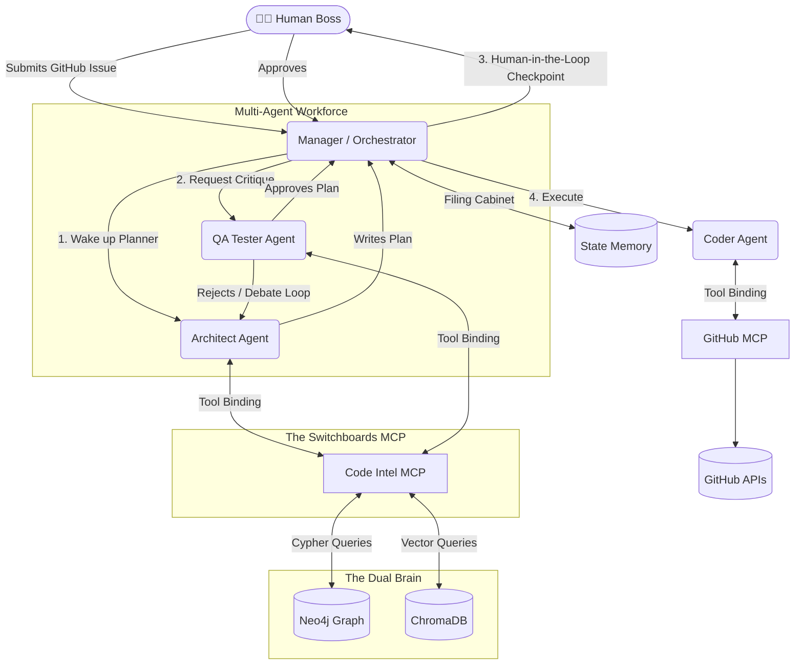

# 🧠 IntelliRepo: Autonomous Multi-Agent Software Engineering System

A modular multi-agent software engineering platform built with FastMCP, Neo4j, and ChromaDB. It combines topological code tracing, local semantic vector search, self-correcting reflection audits, human-in-the-loop plan reviews, and autonomous coding capabilities.


---

## 🌟 Core Engineering Achievements

### 1. 🧠 The Dual-Brain RAG Architecture

Unlike standard RAG pipelines that rely purely on semantic text embeddings, IntelliRepo extracts the Abstract Syntax Tree (AST) of the codebase and maps it as a connected Graph Database ( `Neo4j` ). We also extract Git Blame history and bind it directly to these AST nodes. This allows agents to ask fuzzy semantic questions via `ChromaDB` and then use strict topological graph tracing to calculate the exact structural blast radius of any code change.

### 2. 🔄 Self-Correcting Reflection Audit Loop

Unlike standard linear pipelines, IntelliRepo incorporates a closed-loop quality control node ( `ReflectionAgent` ). It rigorously audits the execution plan created by the Senior Architect. If edge cases or missing dependencies are found, it generates a "Falsifiable Hypothesis", tests it against the Code Intel Radar, and automatically triggers a re-planning debate loop (capped at max 3 iterations).

### 3. 🔌 Dynamic FastMCP Tool Binding

Instead of hardcoding complex Python functions directly into the LLM context window, IntelliRepo exposes its Graph Database, Vector Database, and GitHub APIs via Model Context Protocol ( `MCP` ) Switchboards. The AI Agents dynamically discover and connect to these switchboards on the fly, reducing prompt token consumption and enforcing true separation of concerns.

### 4. 👨‍💻 Human-in-the-Loop Orchestration

An intelligent `Orchestrator` handles intent routing and pauses the automated execution pipeline right before any code is written. It generates a strict, Pydantic-validated `EngineeringReport` and waits for human validation ( `APPROVE` , `REJECT` , or `FEEDBACK` ). If feedback is provided, the AI routes it back to the Architect to revise the plan.

---

## 🏗️ System Architecture



---

## 🚀 Quick Start Guide

### 1. Setup Environment
Copy the template file to create your environment variables:
```bash
cp .env.example .env
```
Open `.env` and configure your API keys (OpenAI/Nvidia, LangSmith, GitHub).

### 2. The Command Line Interface
Interact with the Multi-Agent team using the Front Door CLI:

**Ask the AI Team to fix a bug:**
```bash
python cli.py solve --url "https://github.com/your-repo/issues/123"
```

**Rebuild the Dual-Brain (Graph & Vector):**
```bash
python cli.py build-brain
```
